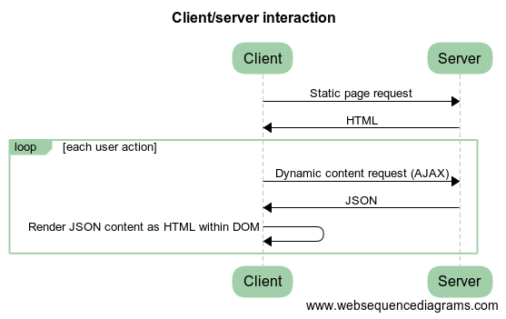

# Web Programming Assignment 2018/19

---

## Dates and weightings

- This assignment contributes 25% to the overall mark for the module, and 50% o
f the coursework mark for the module
- It should be submitted through duo by 14.00 on Wednesday 12th December 2018. Marks should be returned to you by 18th January 2019

---

## Task summary

- Construct a dynamic web-site for a domain of your choosing
- Use static HTML pages loading dynamic JSON content via AJAX
- Client-side content to be responsive using a framework such as Bootstrap
- Server to provide information via JSON through a REST API
- Server to be written in nodejs
- Server to be deployed either locally (for testing) or through cloud

---

## Construct a dynamic web-site for a domain of your choosing

- Any application domain as long as it includes people
- Could be e.g. club, diary, group working, social, health
- Needs to have another item type as well as people e.g. events, photos, comments

---

## Use static HTML pages loading dynamic JSON content via AJAX

- 'Single page app'
- Can have more than one page e.g. for user and admin
- Pages should be standards compliant (HTML5)


---

## Client-side content to be responsive using a framework such as Bootstrap

- Include collapsing navbar (hamburger menu)
- Include a grid layout
- Use Bootstrap or semantic-ui or similar

---

## Server to provide information via JSON through a REST API

- Each person has forename, surname, username plus whatever you want to add
- GET method to list all people at /people
- GET method for individuals at /people/:username
- POST method for adding people, as long as username not taken
- Response provided as JSON
- Content-type needs to be correct
- HTTP codes should be correct: use 400 for POST errors
- On startup Delia Serbyshire (doctorwhocomposer) should be included in people

---

## Initial JSON response for GET /people


---

## Server to be written in nodejs

- Recommended to use express, but not essential
- Use npm for management: installation of packages should work with
```
npm install
```
- Make sure you use --save or --save-dev option with packages you add
- Automated test code (Jest) provided for basic REST functionality
- Separate app and server so that test runs correctly

---

## Server to be deployed either locally (for testing) or through cloud

- Local installation must not use database: use in-memory model
- You can choose cloud deployment platform e.g. OpenShift, BlueMix etc
- Local deployment with
```
npm start
```

- You don't need to include cloud deployment instructions
- Include url of running system

---

## Submission

- Javascript, HTML and CSS sources, including package.json, preferably as zip
- Do not have to include node_modules in submission
- Submit two minute (max) video demonstrating how you web-site works, including all of the requiremements above

---

## Assessment Criteria

- 15% HTML layout and User Experience (UX), including standards compliance
- 20% REST API functionality, assessed by provided test
- 15% HTML/REST integration, based on AJAX
- 10% App complexity/functionality
- 10% Responsive design
- 15% Cloud deployment
- 15% Quality of video submission: structure, visuals, audio

All assessed through video except REST API functionality

